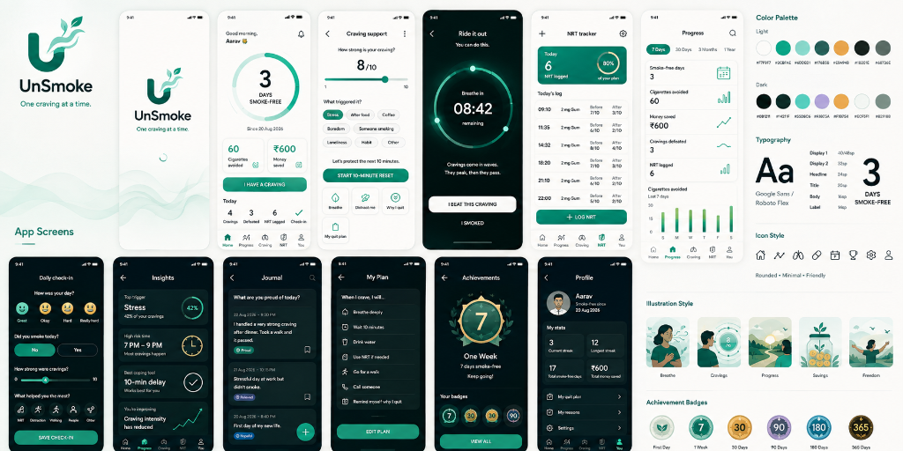

# UnSmoke 🚭

UnSmoke is an evidence-based, gamified Android application designed to help users quit smoking through psychological support, Cognitive Behavioral Therapy (CBT) techniques, and clinical Nicotine Replacement Therapy (NRT) tapering protocols.

## 🚀 Features

- **The 4 D's Protocol & Urge Surfing**: Immediate, actionable coping strategies during peak cravings, accompanied by a visual wave animation mimicking the physiological curve of a craving.
- **NRT 12-Week Tapering Engine**: A clinically-backed tracking engine providing progressive step-down instructions for NRT products (like gums and patches).
- **Health Recovery Timeline**: A visual roadmap unlocking physiological milestones (from 20 minutes to 1 year) as your body heals.
- **Lung Capacity Tracker**: A weekly check-in tool and baseline tracker to visualize respiratory improvement over time.
- **Milestone Badges**: Gamified achievement system rewarding craving resistance and streak consistency.
- **Cost Savings Calculator**: Tracks both gross money saved by not smoking and net savings after deducting NRT expenditures.

## 📸 Screenshots

    
    
    

*(Note: Create a docs/screenshots folder and place home.png, 	imer.png, and progress.png inside to populate this section).*

## 🛠 Tech Stack & Architecture

UnSmoke is built entirely with modern Android development standards:

- **Language**: [Kotlin](https://kotlinlang.org/) (2.0.21)
- **UI Framework**: [Jetpack Compose](https://developer.android.com/jetpack/compose) & Material 3
- **Architecture**: MVVM (Model-View-ViewModel) with Clean Architecture principles
- **Dependency Injection**: [Hilt](https://dagger.dev/hilt/) (2.51.1)
- **Local Storage**: 
  - [Room Database](https://developer.android.com/training/data-storage/room) for structured NRT & craving logs
  - [DataStore](https://developer.android.com/topic/libraries/architecture/datastore) for user preferences and state
- **Coroutines & Flow**: For asynchronous, reactive programming and state management
- **Build System**: Gradle 8.14 (Kotlin DSL) & Version Catalogs (libs.versions.toml)

## 🏗 Project Structure

`	ext
app/src/main/kotlin/com/unsmoke/app/
├── core/                  # Core infrastructure and shared components
│   ├── data/              # Room DB, DataStore, Repositories, Entities
│   ├── domain/            # CalculationEngine, NRTTaperingEngine, Achievements
│   ├── designsystem/      # Theme, Typography, Colors, Shared Composables
├── feature/               # Feature modules (MVVM structure)
│   ├── home/              # Dashboard and savings overview
│   ├── onboarding/        # First-time user setup & baseline capture
│   ├── progress/          # Streak tracking, badges, and lung capacity
│   ├── cravings/          # Urge surfing and timer mechanics
│   ├── settings/          # User preferences
├── UnSmokeApplication.kt  # Hilt Application Class
└── MainActivity.kt        # Entry Point
`

## 💻 How to Setup and Run Locally

### Prerequisites
- **Android Studio**: Koala / Jellyfish (or newer) recommended.
- **Java Development Kit (JDK)**: **Java 21** is strictly required to compile this project.

### Installation Steps
1. **Clone the repository**:
   `ash
   git clone https://github.com/Aarush1137/UnSmoke.git
   `
2. **Open the Project**:
   Launch Android Studio and select File > Open, then navigate to the cloned UnSmoke directory.
3. **Configure Gradle JDK**:
   - Go to File > Settings (or Android Studio > Settings on macOS).
   - Navigate to Build, Execution, Deployment > Build Tools > Gradle.
   - Ensure the **Gradle JDK** is set to a JDK 21 installation (e.g., Embedded JDK or local corretto-21).
4. **Sync and Build**:
   Click the **Sync Project with Gradle Files** button. Once synced, select the pp configuration and click **Run** (Shift + F10) to deploy to an emulator or physical device.

## 🤝 Contributing
Pull requests are welcome! For major changes, please open an issue first to discuss what you would like to change.

## 📄 License
[MIT](https://choosealicense.com/licenses/mit/)