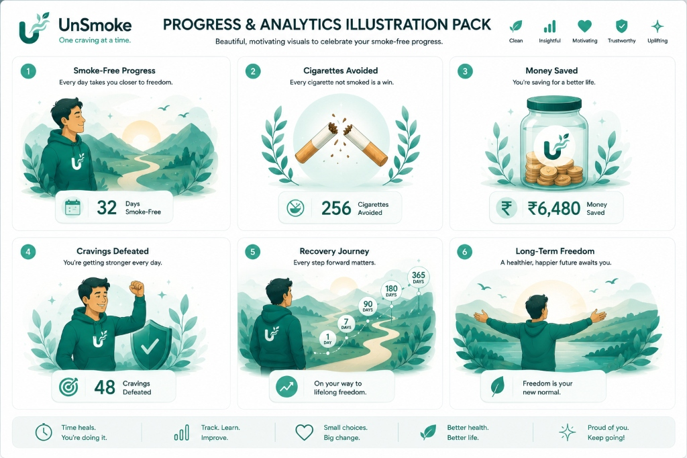

  
  <h1>UnSmoke 🚭</h1>
  
<b>The Evidence-Based, Gamified Quit Smoking Companion</b>

---

UnSmoke is an advanced Android application designed to help users quit smoking through a combination of psychological support, **Cognitive Behavioral Therapy (CBT)** techniques, and clinical **Nicotine Replacement Therapy (NRT)** tapering protocols. Built entirely with Jetpack Compose and Kotlin 2.0.

## 📸 Screenshots

  
  &nbsp;&nbsp;&nbsp;
  
  &nbsp;&nbsp;&nbsp;
  

---

## 🛠️ In-Depth Features

### 🌊 1. Urge Surfing & The 4 D's Protocol
When a craving hits, users can launch the **Craving Timer**. It features a visual "breathing wave" animation that mimics the physiological curve of a craving (which usually peaks and subsides within 3-5 minutes). 
While the timer runs, the app provides the **4 D's Toolkit**:
- **Delay:** Wait 5 minutes.
- **Deep Breathe:** Follow the animated visualizer.
- **Drink Water:** Distract the oral fixation.
- **Distract:** Engage the mind elsewhere.

### 💊 2. Clinical NRT Tapering Engine
UnSmoke doesn't just track your days; it actively manages your nicotine step-down. The integrated **NRT Tapering Engine**:
- Calculates progressive 12-week step-down instructions based on your baseline.
- Tracks gum/patch usage directly in the NRT Dashboard.
- Deducts NRT expenditure from your total "Money Saved" for an accurate financial picture.

### 🫁 3. Lung Capacity & Health Recovery
Track how your body heals over time:
- **Baseline Capture:** During onboarding, users hold their breath to establish a baseline lung capacity.
- **Weekly Check-ins:** The app prompts you weekly to re-test your breath-hold, visualizing respiratory improvement via a dynamic expanding lung widget.
- **Health Timeline:** Unlock physiological milestones—from 20 minutes (blood pressure normalizing) to 1 year (heart disease risk halving).

### 🏆 4. Gamified Milestone Badges
A comprehensive achievement engine rewards both craving resistance and streak consistency:
- **Milestone Badges:** Unlocked at 24 hours, 3 days, 1 week, 1 month, etc.
- **Craving Crusher Badges:** Earned by successfully letting the Craving Timer run its course without giving in.

---

## 🚀 Phase 9 Features (In Progress)
- **Wear OS Companion App:** A dedicated watch face for logging cravings and triggering haptic breathing exercises directly from your wrist.
- **Health Connect Integration:** Overlaying physical health data (Resting Heart Rate, Sleep) on top of craving data to prove the physiological benefits of quitting.
- **AI Quit Coach:** Using Gemini Nano to process daily journal entries and predict relapse triggers before they happen.

---

## 🏗️ Project Architecture

Built with modern Android standards:
- **UI:** Jetpack Compose, Material 3
- **Architecture:** MVVM (Model-View-ViewModel) + Clean Architecture
- **Dependency Injection:** Dagger Hilt
- **Database:** Room (SQLite)
- **Asynchronous Operations:** Kotlin Coroutines & Flow
- **Data Persistence:** DataStore (Preferences)

`	ext
Unsmoke/
├── app/
│   ├── src/main/kotlin/com/unsmoke/app/
│   │   ├── core/           # Room DB, Repositories, DataStore, Design System
│   │   ├── feature/        # Screen ViewModels & Compose UIs (Home, Craving, Analytics)
│   │   └── widget/         # Glance App Widgets (Dashboard, Streak)
├── wear/                   # WearOS Companion Module
└── docs/                   # Screenshots & Assets
`

## 🛠️ Build & Install

1. Clone the repository:
   `ash
   git clone https://github.com/Aarush1137/UnSmoke.git
   `
2. Open the project in **Android Studio Koala** (or newer).
3. Build and Run the :app configuration on your Android device (Android 8.0+ required).

---
*Built to help you breathe easier.*